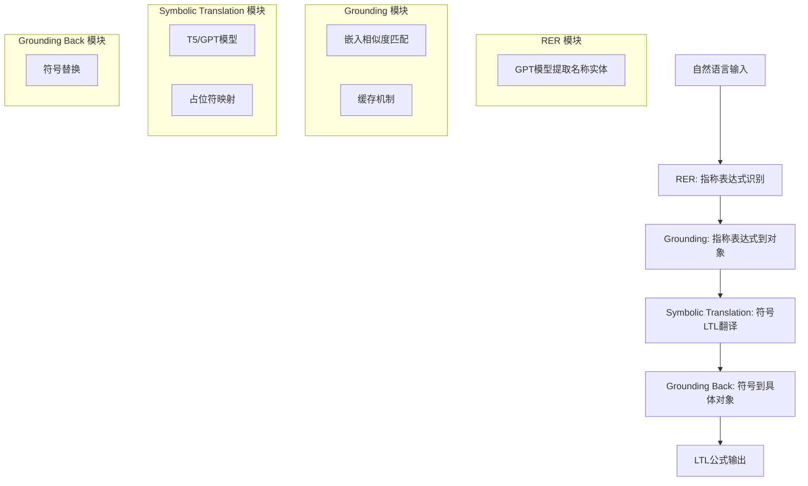

# Lang2LTL 代码结构详细文档

## 项目概述

Lang2LTL 是一个将自然语言命令转换为线性时态逻辑 (LTL) 公式的系统，专门用于机器人时空导航任务。该项目实现了从自然语言到形式化逻辑规范的端到端翻译，支持多种环境和模型架构。

## 核心架构

Lang2LTL 采用模块化设计，主要包含以下四个核心步骤：



## 主要模块和文件功能

### 核心模块

#### `lang2ltl.py`
- **功能**: 核心API模块，包含主要的 `lang2ltl()` 函数
- **主要函数**:
  - `lang2ltl()`: 完整的翻译流程入口
  - `rer()`: 指称表达式识别
  - `ground_res()`: 指称表达式 grounding
  - `ground_utterances()`: 话语 grounding
  - `translate_grounded_utts()`: 符号翻译

#### `utils.py`
- **功能**: 工具函数集合
- **主要函数**:
  - `substitute()`: 字符串替换
  - `build_placeholder_map()`: 构建占位符映射
  - `name_to_prop()`: 名称到命题转换
  - `prefix_to_infix()`: LTL公式格式转换
  - `load_from_file()` / `save_to_file()`: 文件I/O操作

### 数据处理模块

#### `dataset_*.py` 系列
- **`dataset_lifted.py`**: 生成提升数据集（符号化命题）
- **`dataset_grounded.py`**: 生成具体环境数据集（OSM/Cleanup）
- **`dataset_composed_new.py`**: 构造组合数据集（and/or操作）
- **`dataset_filtered.py`**: 导入和过滤现有数据集
- **`data_collection.py`**: 数据清洗和整理

### 模型模块

#### `s2s_*.py` 系列
- **`s2s_sup.py`**: 通用监督序列到序列模型
- **`s2s_hf_transformers.py`**: HuggingFace transformers微调脚本
- **`s2s_pt_transformer.py`**: PyTorch transformer从头训练

#### `gpt.py`
- **功能**: OpenAI GPT-3/4 接口封装
- **类**: `GPT3`, `GPT4`

#### `get_embed.py`
- **功能**: GPT嵌入生成接口

### 实验和评估模块

#### `exp_*.py` 系列
- **`exp_full.py`**: 完整实验流水线
- **`exp_baselines.py`**: 基线方法实验
- **`exp_nl2ltl.py`**: 自然语言到LTL实验
- **`exp_robot_demo.py`**: 机器人演示实验

#### `eval.py`
- **功能**: 翻译和规划评估函数

#### `analyze_results.py`
- **功能**: 结果分析和统计

#### `plot_results.py`
- **功能**: 结果可视化

### 其他工具模块

#### `formula_sampler.py`
- **功能**: LTL公式采样器

#### `compose.py`
- **功能**: 公式组合操作（and/or）

#### `prompt_conversion.py`
- **功能**: 提示转换工具

#### `tester.py`
- **功能**: 单元测试

## 数据集结构

### 数据集类型

1. **提升数据集 (Lifted Dataset)**
   - 命题使用符号：a, b, c等
   - 用于训练符号翻译模块
   - 文件：`symbolic_no_perm.csv`, `symbolic_perm.csv`

2. **具体数据集 (Grounded Dataset)**
   - 使用实际环境地标
   - 支持OSM城市和Cleanup World环境
   - 文件：`osm_filtered.filtered`, `cleanup_corlw.csv`

3. **组合数据集 (Composed Dataset)**
   - 通过逻辑运算符组合基本公式
   - 支持and/or操作
   - 文件：`composed_*.pkl`

### 数据结构

```python
# 基本数据对
data_pair = (utterance: str, ltl_formula: str)

# 元数据
metadata = (pattern_type: str, props: tuple)
# pattern_type: "visit", "avoidance", "global_avoidance"等
# props: ("a", "b", "c") 等命题元组
```

## 实验框架

### 实验配置

- **域 (Domain)**: `osm`, `cleanup`
- **翻译模块**: `t5-base`, `gpt3_finetuned`, `gpt3_pretrained`
- **Holdout设置**: `utt`, `formula`, `type`
- **端到端模式**: `full_e2e`, `modular`

### 主要实验脚本

```bash
# 完整实验
python exp_full.py --domain osm --envs new_york_1

# 端到端翻译
python exp_full.py --full_e2e gpt4

# 模块化方法
python exp_full.py --translate_e2e
```

## 结果分析和存储

### 结果存储结构

```
results/
├── CopyNet/           # 基线方法结果
├── finetuned_gpt3/    # GPT微调结果
├── corlw/            # CoRLW环境结果
└── tcd/              # TCD结果
```

### 分析工具

- **准确率计算**: `analyze_results.py`
- **可视化**: `plot_results.py`
- **统计分析**: 混淆矩阵、错误分类等

## 依赖和环境

### 主要依赖

- **深度学习**: PyTorch, Transformers, Datasets
- **NLP**: NLTK, OpenAI API, tiktoken
- **LTL处理**: Spot库
- **数据处理**: Pandas, NumPy, Scikit-learn
- **可视化**: Plotly, Matplotlib, Seaborn

### 环境设置

```bash
conda create -n lang2ltl python=3.9
conda activate lang2ltl
pip install openai tiktoken nltk seaborn pyyaml
conda install pytorch transformers spot
```

## 开发指南

### 代码风格

- **命名**: snake_case (函数/变量), CamelCase (类)
- **缩进**: 4个空格
- **文档**: Sphinx风格docstring
- **导入**: 标准库 -> 第三方 -> 本地模块

### 测试

```bash
# 运行所有测试
python tester.py

# 运行特定测试类
python -m unittest tester.TestUtils
```

### 版本控制

- **提交信息**: `<type>: <subject>`
- **类型**: `feat`, `fix`, `docs`, `style`, `refactor`, `test`

## 扩展和定制

### 添加新环境

1. 在 `dataset_grounded.py` 中添加环境处理逻辑
2. 定义命题转换规则
3. 更新评估脚本

### 添加新模型

1. 在相应模块中实现模型接口
2. 更新 `lang2ltl.py` 中的模型选择逻辑
3. 添加训练/微调脚本

### 添加新数据集

1. 实现数据加载函数
2. 定义数据格式转换
3. 更新实验配置

## 总结

Lang2LTL 项目具有良好的模块化架构，便于扩展和维护。核心思想是通过多阶段处理将复杂的自然语言理解任务分解为可管理的子任务，每个模块都可以独立优化和替换。该架构支持多种模型和环境，为机器人任务规划提供了强大的形式化工具。